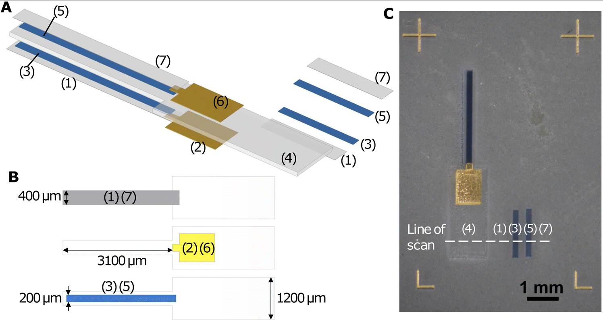

The prg files in AutoCAD/ are for aerosol jet printing of a 7-layer structure of a electrochemical actuator from https://doi.org/10.1039/D4SM00886C 

In the printing session, Nafion, Au, PEDOT:PSS, Nafion, PEDOT:PSS, Au, and Nafion were sequentially deposited on a glass slide, forming a 7-layer structure as illustrated below. 

 (A) Exploded diagram showing a multilayer structure of the AJP actuator and sequence of printing. The rectangular pieces on the right are thickness test samples. Layer 1: Nafion bottom encapsulation layer; layer 2: Au bottom layer; layer 3: PEDOT:PSS bottom layer; layer 4: Nafion electrolyte layer; layer 5: PEDOT:PSS top layer; layer 6: Au top layer; and layer 7: Nafion top encapsulation layer. The thickness of each layer is exaggerated ∼10 times in comparison to length and width. (B) Diagram showing the position of Nafion encapsulation layers (layers 1 and 7), Au layers (layers 2 and 6) and PEDOT:PSS layers (layers 3 and 5) relative to the Nafion electrolyte layer (layer 4). (C) Optical image of a printed actuator along with thickness test samples. The fiducial markers at the corners are printed to ensure accurate alignment of different layers. The thickness of layers 4, 1, 3, 5, and 7 are obtained by profilometer scanning along the direction shown with the dashed line.

